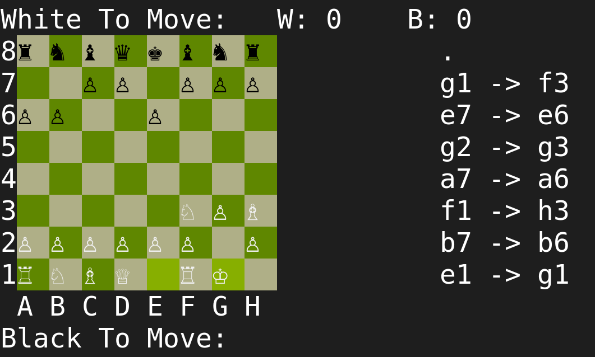

# Working??

## Although this compiles and works fine, the display is broken unless you set your terminal's font to "Cascadia Mono" or any other font with chess pieces.

### Features
* Capturing
* Valid moves only
* Board value tracker
* Promoting
* Castling
* EnPessant
* Moves history
* Last move hilight

