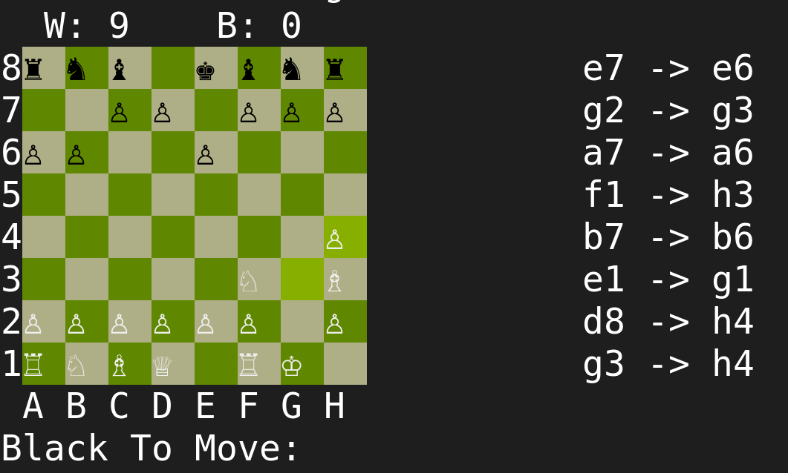

# Console Games Collection

A collection of classic games implemented in C++ for the console/terminal environment. These projects showcases various programming concepts and game development techniques while maintaining a minimalist, text-based interface.

## 🎮 Games Included

1. **Chess**
   - Full implementation of chess rules including special moves (castling, en passant, pawn promotion)
   - Local PVP mode with move history and score tracking
   - Unicode chess pieces for beautiful display

2. **Typing trainer**
   - Multiple training modes
   - Custom menus and submenus implementation
   - Many difficulty settings and modifiers
   - Accuracy, WPM and mistakes display
   - Time limits

3. **Snake**
   - Classic snake game with score tracking
   - Smooth movement and directional indicators
   - Wall collision detection
   - Fruit collection mechanics

4. **Conway's Game of Life**
   - Implementation of the famous cellular automaton
   - Configurable board size and update speed
   - Preset patterns available
   - Generation counter

5. **One Variable Game**
   - Unique timing-based game
   - Binary visualization
   - Simple yet challenging gameplay

6. **Minesweeper**
   - Traditional Minesweeper gameplay
   - Recursive tile revealing
   - Flag placement system
   - Win/loss detection

7. **Pac-Man**
   - Recreation of the classic arcade game
   - Sprite-based rendering in console
   - WIP

8. **Tic Tac Toe**
   - Classic X's and O's game
   - Input coordinate system

## 🛠️ Technical Features

- Pure C++ implementation
- Console-based UI with ANSI escape codes for colors and formatting
- Object-oriented design patterns
- Smart pointer usage for memory management
- Multi-threading for game loops and input handling
- Unicode character support
- Cross-platform compatibility (Linux/Unix)

## 🚀 Getting Started

### Prerequisites
- C++ compiler with C++17 support
- Unix-like environment (Linux, macOS, WSL)

## 🎯 Game Controls

### General Controls
- WASD: Movement/Navigation
- Enter: Confirm/Start
- P: Pause (where applicable)

### Game-Specific Controls
- **Chess**: Algebraic notation (e.g., "e2 e4")
- **Snake**: WASD for direction
- **Minesweeper**: Row/Column numbers + 'f' for flag
- **Tic Tac Toe**: Grid numbers 1-9 or coordinate pairs