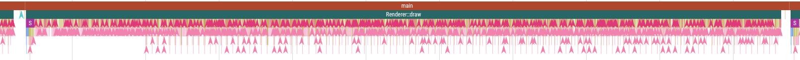

# 3D OpenGL Renderer

A custom 3D graphics renderer built from scratch using OpenGL, demonstrating modern graphics programming concepts and real-time rendering techniques.

## 🌟 Features

- Modern OpenGL-based rendering pipeline
- Entity Component System (ECS) architecture
- Real-time 3D graphics rendering
- Multiple colored light support
- Physics simulation capabilities
- Custom mesh generation and manipulation
- Interactive camera controls
- Wireframe visualization mode
- Performance profiling tools

*Note: This project was developed as a learning experience in 3D graphics programming and OpenGL thus it does not follow best practices or do things in the most optimal way. The goal was to just pick a random topic and try to implement it with my knowledge at that time or research just enough to be able to implement it.*

*"After 'completing' [Hexxy2D](https://github.com/Hexxy-Dev/Old_Code/tree/main/Hexxy2D) I wanted to try my hand at 3D graphics. Here is where I mostly abandoned tutorials and just wrote code that I tought made sense, hence why it's **very wierd** in some places."*

## 🔧 Technical Stack

- **Graphics**: OpenGL with GLFW windowing
- **Mathematics**: GLM (OpenGL Mathematics)
- **Debug UI**: Dear ImGui
- **Asset Loading**: STB Image
- **Build System**: Premake5

### Prerequisites
- C++ compiler with C++17 support
- OpenGL 4.5+ compatible graphics card

## 🎮 Controls

- **WASD**: Camera movement
- **Mouse**: Look around
- **F**: Toggle wireframe mode
- **Left Alt**: Toggle mouse cursor
- **Scroll**: Zoom in/out
- **ESC**: Exit application

## 🏗️ Architecture

The renderer is built with a modular architecture:

- `src/OpenGL/`: Core rendering systems
- `src/ECS/`: Entity Component System
- `src/Physics/`: Physics simulation
- `src/Scene/`: Scene management
- `src/MeshGenerators/`: Procedural geometry
- `src/Model/`: 3D model handling

## 🔍 Implementation Details

The renderer implements several modern graphics programming concepts:

- Forward rendering pipeline
- Dynamic lighting system
- Custom shader management
- Vertex buffer abstraction
- Performance-optimized draw calls

## 🎯 Performance

The renderer is optimized for real-time performance:

- Efficient batch rendering
- Smart resource management
- Chrome profiler integration for performance analysis
- Minimal state changes during rendering

